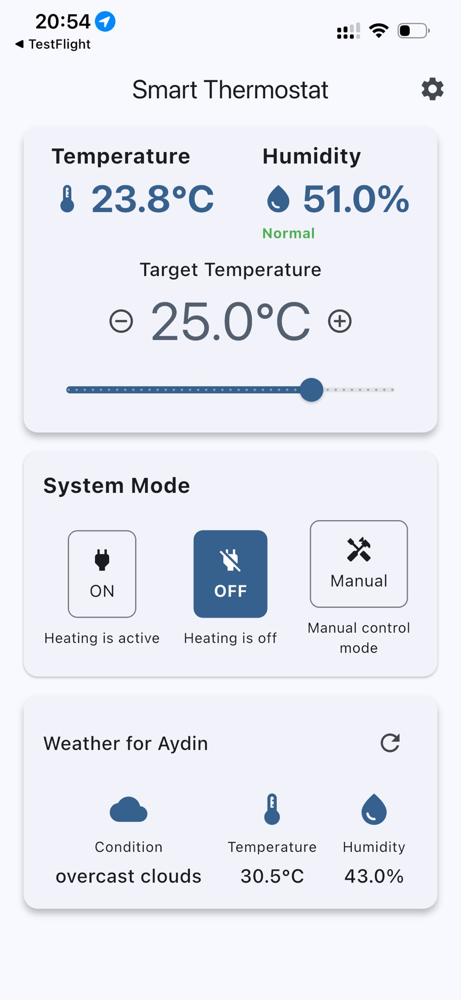
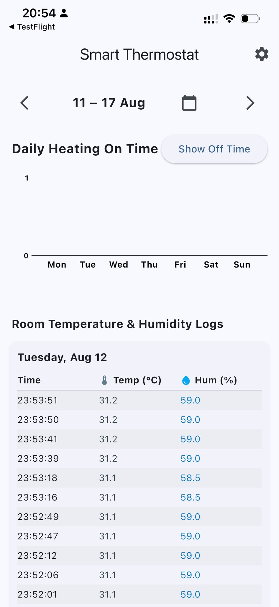
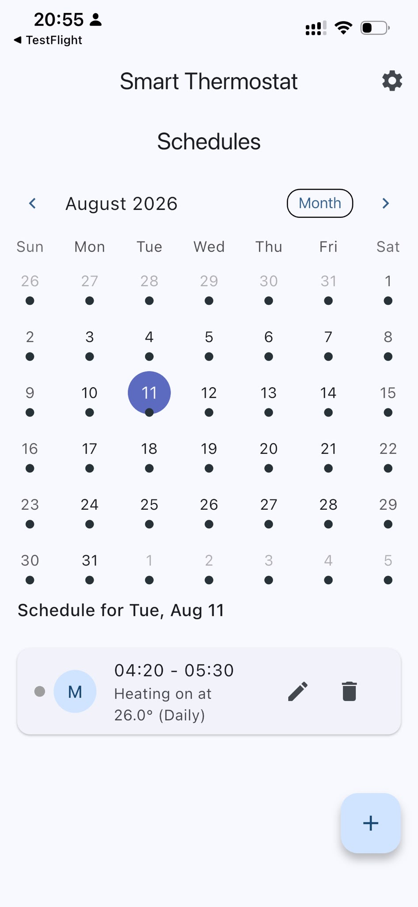

# Akıllı Kombi Termostatı

<p align="center">
  <strong>ESP32, ESP8266 ve Flutter ile geliştirilen uzaktan kontrollü akıllı ısıtma sistemi.</strong>
</p>

## Proje Tanımı

Akıllı Kombi Termostatı, evin sıcaklık ve nem değerlerini takip ederek kombiyi otomatik biçimde yöneten kişisel bir IoT projesidir.

Sistem iki ayrı mikrodenetleyici kullanır: ekranlı **ESP32** ortam ölçümlerini gerçekleştirir ve kullanıcıya yerel olarak gösterir; kombiye bağlı **ESP8266** ise ölçümleri ve kullanıcı ayarlarını değerlendirerek röle üzerinden ısıtmayı açıp kapatır. Flutter ile geliştirilen mobil uygulama; hedef sıcaklık ayarı, manuel kontrol, zamanlama, kullanım geçmişi, hava durumu ve konuma bağlı otomasyon özelliklerini tek yerde toplar.

## Öne Çıkan Özellikler

- Anlık oda sıcaklığı ve nem takibi
- Hedef sıcaklık belirleme
- Otomatik kombi açma ve kapatma
- Manuel kontrol modu
- Gün ve saat bazlı ısıtma programları
- Günlük çalışma süresi ile sıcaklık ve nem geçmişi
- Eve yaklaşınca açma, uzaklaşınca kapatma
- Dış hava durumu bilgileri
- ESP32 üzerindeki ekrandan yerel görüntüleme

## Sistem Mimarisi

```text
                                  Kullanıcı ayarları
                         Hedef sıcaklık, mod ve program
                                          |
                                          v
+----------------------+          +----------------------+          +---------+          +-------+
| ESP32 Ölçüm Birimi   |          | ESP8266 Kontrol      |          | Röle    |          | Kombi |
|                      |  Ölçüm   | Birimi               |  Kontrol |         |  Aç/Kapat |       |
| Sıcaklık ve nem      | -------> | Verileri analiz eder | -------> |         | --------> |       |
| Ekranda gösterim     |          | Karar verir          |          |         |          |       |
+----------------------+          +----------------------+          +---------+          +-------+
                                          ^
                                          |
                               Mobil uygulama üzerinden
                             kontrol, program ve konum bilgisi
```

1. ESP32, odanın sıcaklık ve nem değerlerini ölçer ve ekranında gösterir.
2. Ölçüm bilgileri ESP8266 kontrol birimine iletilir.
3. ESP8266; ölçülen sıcaklığı hedef sıcaklık, çalışma modu, aktif program ve konum durumuyla birlikte değerlendirir.
4. Isıtma gerektiğinde röleyi etkinleştirerek kombiyi açar.
5. Hedef koşullar sağlandığında röleyi kapatarak ısıtmayı durdurur.
6. Mobil uygulama üzerinden sistem kontrol edilir ve kullanım kayıtları görüntülenir.

## Donanım

<table>
  <tr>
    <td width="50%" valign="top">
      <h3>ESP32 Ölçüm Birimi</h3>
      <ul>
        <li>Oda sıcaklığı ve nemini ölçer.</li>
        <li>Değerleri yerel ekranda gösterir.</li>
        <li>Ölçümleri kontrol sistemine iletir.</li>
      </ul>
      <p><em>Cihaz fotoğrafı yakında eklenecek.</em></p>
    </td>
    <td width="50%" valign="top">
      <h3>ESP8266 Kontrol Birimi</h3>
      <ul>
        <li>Kombinin termostat girişine bağlıdır.</li>
        <li>Kontrol kararlarını uygular.</li>
        <li>Röle üzerinden kombiyi açar veya kapatır.</li>
      </ul>
      <p><em>Cihaz fotoğrafı yakında eklenecek.</em></p>
    </td>
  </tr>
</table>


## Mobil Uygulama

<table>
  <tr>
    <td align="center"><strong>Ana kontrol</strong></td>
    <td align="center"><strong>Kullanım geçmişi</strong></td>
    <td align="center"><strong>Programlar</strong></td>
  </tr>
  <tr>
    <td></td>
    <td></td>
    <td></td>
  </tr>
</table>

## Proje Yapısı

```text
Termostat/
├── esp32_thermostat/     # Sensör ve ekran yazılımı
├── esp8266_thermostat/   # Röle ve kombi kontrol yazılımı
├── termostat_app/        # Flutter mobil uygulaması
├── docs/images/          # README görselleri
├── LICENSE               # MIT Lisansı
└── README.md
```

## Güvenlik

> [!WARNING]
> Kombi bağlantısı elektrik ve gaz güvenliği açısından risklidir. Yalnızca kombi üreticisinin belirttiği kuru kontak termostat girişini ve elektriksel olarak izole edilmiş uygun bir röle modülünü kullanın. Şebeke gerilimine doğrudan müdahale etmeyin; gerektiğinde yetkili bir uzmandan destek alın.

## Lisans

Bu proje [MIT Lisansı](LICENSE) ile açık kaynak olarak yayımlanmıştır.
